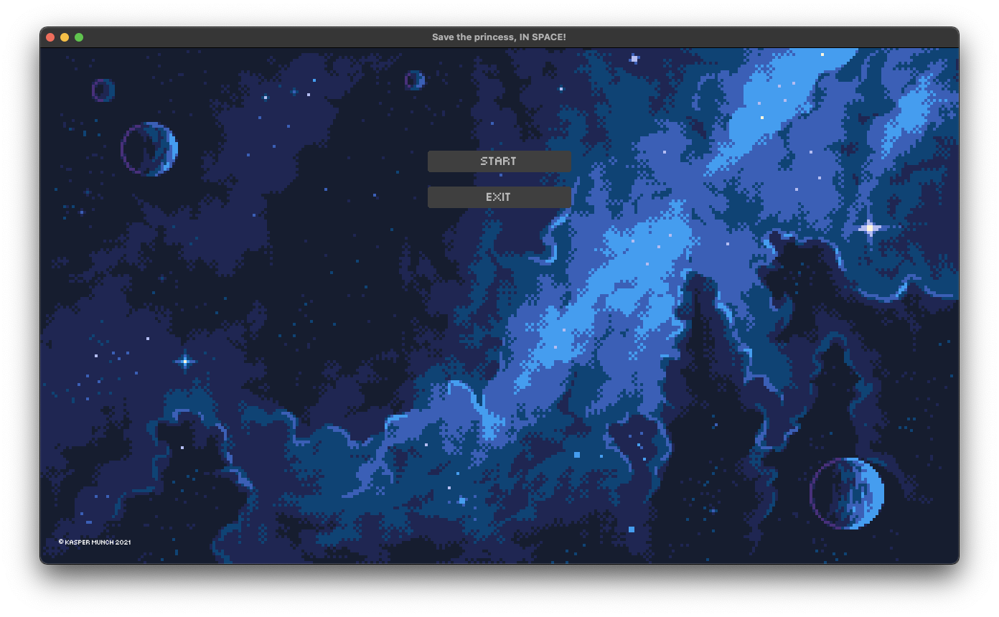

# TowerDefence

An isometric tower defence game made in **LÖVE** with Lua. It supports **Mac OS, Windows, iOS and Android** (very much cross-platform). The goal of the game is to survive as long as possible by saving the princess, making it an endless Tower Defence game.
Maps are randomly generated and so are the waves which you will fight!

This is VERY much still in development, but below are some images giving you an idea of the art. The content of this repository does not contain images for the project, only the source code.

## Guide on how to render isometric tiles

I also wrote a guide on how to do the rendering of isometric tiles in LÖVE. You can read the guide here.
[Rendering tile-based isometric maps in LÖVE2D](http://www.kaspermunch.xyz/isometricTileRendering/)

## Previews of the game to come

